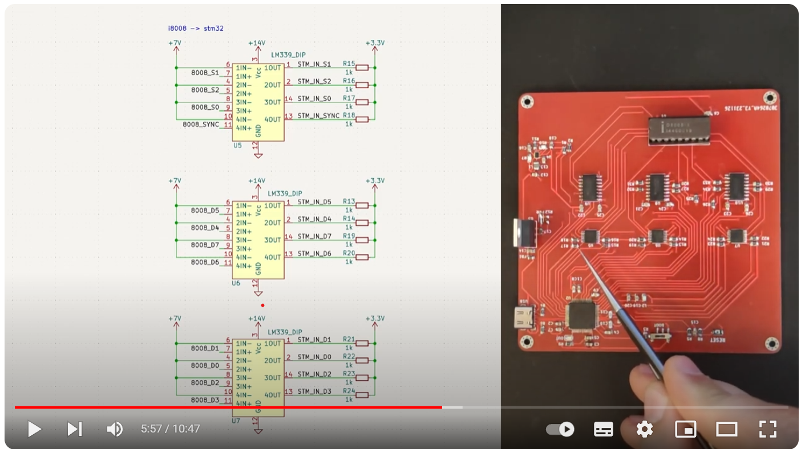
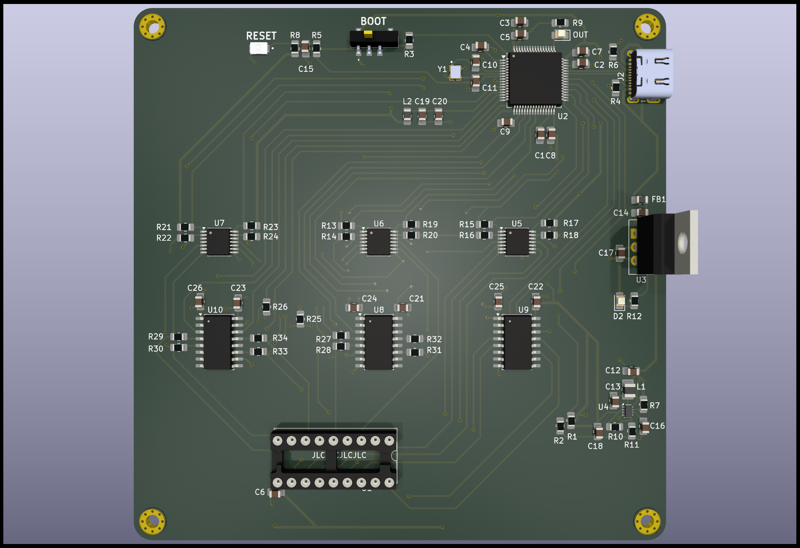
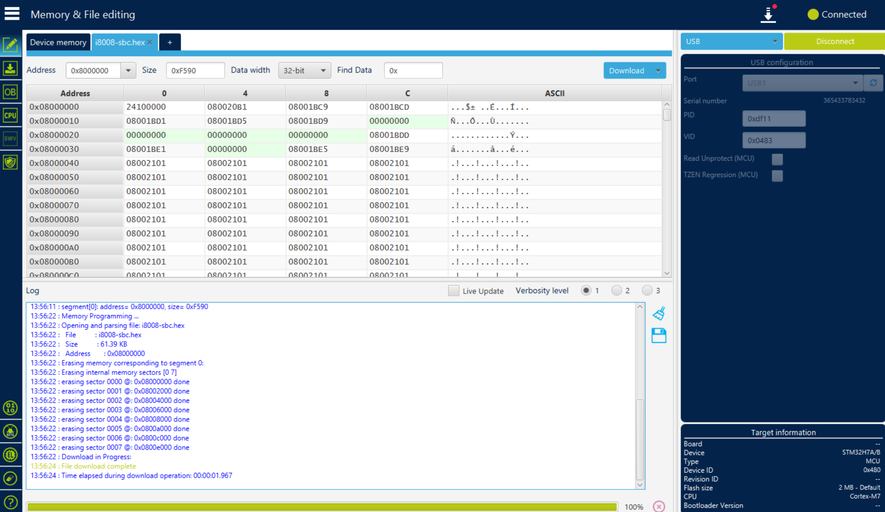

# System board for Intel 8008

Video about this project:
[](https://www.youtube.com/watch?v=hh_iSX-aM4Q "Video about this project")

## Board

Schematics in [pdf format](./pcb/schematic.pdf)


Archive with gerber files and drill locations could be found [here](./pcb/manufacturing/manufacturing.zip)



Bill of material in [CSV format](./pcb/i8008-sbc.csv)

|Reference                                            |Value            |Qty|Mouser Part Number  |
|-----------------------------------------------------|-----------------|---|--------------------|
|C4,C5,C6,C7,C8,C9,C13,C15,C20,C21,C22,C23,C24,C25,C26|100n             |15 |187-CL21B104KACNFNC |
|R13,R14,R15,R16,R17,R18,R19,R20,R21,R22,R23,R24      |1k               |12 |603-RT0805FRE071KL  |
|R5,R27,R28,R29,R30,R31,R32,R33,R34                   |220              |9  |603-RT0805FRE10220RL|
|R1,R2,R3,R8,R25,R26                                  |10k              |6  |603-RT0805FRE1310KL |
|U8,U9,U10                                            |CD40109B         |3  |595-CD40109BNSR     |
|U5,U6,U7                                             |LM339_DIP        |3  |595-LM339APWR       |
|C14,C16,C19                                          |1u               |3  |187-CL21B105KOFNNNE |
|R7,R11                                               |30k              |2  |603-RT0805FRE0730KL |
|R4,R6                                                |5k1              |2  |603-RT0805FRE075K1L |
|C17,C18                                              |10u              |2  |810-C2012JB1C106M08C|
|C10,C11                                              |10p              |2  |710-885012007010    |
|C3,C12                                               |4u7              |2  |810-C2012X5R1C475M0B|
|C1,C2                                                |2u2              |2  |187-CL21A225KAFNNNG |
|Y1                                                   |16Mhz            |1  |520-160-10-36CKM-TR3|
|U4                                                   |MP3438           |1  |946-MP3438GTL-P     |
|U3                                                   |LM2937xT         |1  |926-LM2937ET-3.3NOPB|
|U2                                                   |STM32H7A3RGTx    |1  |511-STM32H7A3RGT6   |
|U1                                                   |Intel 8008       |1  |571-1-2199298-5     |
|SW2                                                  |RESET            |1  |667-EVP-AWED4A      |
|SW1                                                  |BOOT             |1  |113-SS3PMVT/R    |
|R12                                                  |2k2              |1  |603-RT0805FRE072K2L |
|R10                                                  |390k             |1  |603-RT0805FRE07390KL|
|R9                                                   |4k7              |1  |603-RT0805FRE074K7L |
|L2                                                   |27n              |1  |652-CE201210-27NJ   |
|L1                                                   |8u2, 800mA       |1  |652-SRR1280-8R2Y    |
|J2                                                   |Type-C           |1  |656-DX07S016JA1R1500|
|FB1                                                  |FerriteBead_Small|1  |652-MH2029-101Y     |
|D2                                                   |Green            |1  |710-150080VS75000   |
|D1                                                   |Red              |1  |710-150080RS75000   |

Also you can find prepared Mouser project [here](https://www.mouser.com/ProjectManager/ProjectDetail.aspx?AccessID=507c82b5f1).

## Firmware

There is compiled [hex file](./firmware/bin/i8008-sbc.hex) in repository, that could be flashed to PCB.

Make sure that `BOOT` switch lever shifted in direction of `RESET` button and connect the board via USB and use stm32 programming software. I am using stm32programmer.



## Software

Make sure that `BOOT` switch lever shifted in direction of stm32 MCU and connect the board via USB.

Red LED should be lighting and new terminal COM device should appear in the system.

To actually run a program in 8008 you just need to run single command:
```sh
node index.js -port=COM5 -rom="programs/blank.i8008"
```

Where `COM5` is the port name. And ROM is the path for program to be run.
